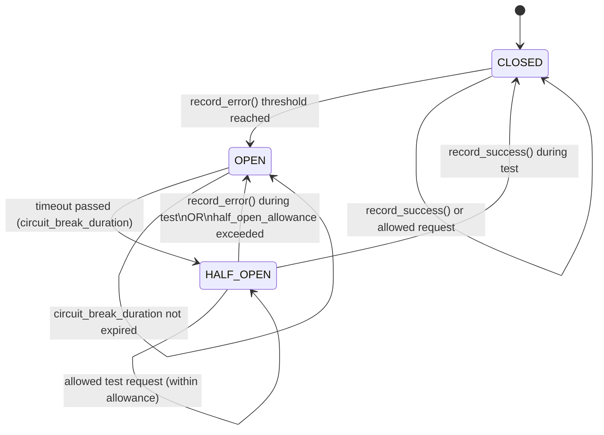

# Rate Limiter and Circuit Breaker

The system has a built-in rate limiter and circuit breaker to manage the load and ensure stability. The rate limiter controls the number of requests that can be processed within a
given time frame, while the circuit breaker prevents the system from being overwhelmed by temporarily blocking requests when certain thresholds are exceeded.

The following default configurations are applied:

```ini
[ratelimit]
enabled = True
redis_host = source-connector-api-redis
redis_port = 6379
redis_db = 0
default_reqs = 300
default_window = 60
circuit_break_threshold = 10
circuit_break_window = 60
circuit_break_duration = 300
half_open_allowance = 5
```

### Configuration Parameters

- `enabled`: Enable or disable the rate limiter and circuit breaker.
- `redis_host`: Hostname of the Redis server used for rate limiting.
- `redis_port`: Port of the Redis server used for rate limiting.
- `redis_db`: Database number in Redis used for rate limiting.
- `default_reqs`: Default number of requests allowed within the specified time window.
- `default_window`: Time window in seconds for the rate limiter.
- `circuit_break_threshold`: Number of failed requests that will trigger the circuit breaker.
- `circuit_break_window`: Time window in seconds to monitor for failed requests before triggering the circuit breaker.
- `circuit_break_duration`: Duration in seconds for which the circuit breaker will block requests after being triggered.
- `half_open_allowance`: Number of requests allowed in the half-open state after the circuit breaker is triggered.

## Sliding Window Rate Limiter

The rate limiter prevents clients from exceeding a defined number of requests over a time window. It uses a sliding window algorithm backed by Redis to track request timestamps with fine-grained control.

### How It Works

For each unique key (e.g. user, IP, API token), the rate limiter:

- Stores each request timestamp in a Redis sorted set (ZADD) under a key like rate_limit:{key}.
- Removes expired timestamps older than the configured window using ZREMRANGEBYSCORE.
- Counts the remaining timestamps (ZCARD) to determine how many requests were made in the current window.
- If the number of requests exceeds the allowed maximum (reqs), the request is rejected.
- Otherwise, the request is allowed, and the new timestamp is added to the set.
- The set is set to expire after the window period to clean up unused keys.

## Circuit Breaker



### Circuit Breaker Logic

The circuit breaker protects the system from overload or repeated failures by tracking error rates over time and temporarily blocking requests when necessary. It operates in three states:

#### CLOSED

The system is operating normally. All requests are allowed, and errors are tracked over a sliding window.

- If the number of errors within circuit_break_window exceeds circuit_break_threshold, the circuit transitions to OPEN.

#### OPEN

The circuit is temporarily blocking requests due to excessive failures.

- Requests are immediately rejected with a "circuit_open" reason.
- After circuit_break_duration has passed, the circuit transitions to HALF_OPEN to test recovery.

#### HALF_OPEN

A limited number of requests (half_open_allowance) are allowed to probe if the system has recovered.

- If a test request succeeds (record_success() is called), the circuit resets to CLOSED.
- If any test request fails (record_error() is called), or the allowance is exhausted without success, the circuit returns to OPEN.

### Request Handling Flow

- When a request is made, the circuit state is checked:
  - If OPEN, reject immediately unless circuit_break_duration has passed.
  - If HALF_OPEN, only allow up to half_open_allowance requests.

- For allowed requests:
  - Rate limiting is applied (based on request count per time window).
  - If the request exceeds the rate limit, it's rejected and counted as an error.
  - If the request is successful, and the circuit is HALF_OPEN, it triggers a transition back to CLOSED.

- On any error, record_error() should be called to increment the failure count. This may trigger a transition to OPEN.

- On successful handling of a HALF_OPEN request, record_success() should be called to fully close the circuit.
